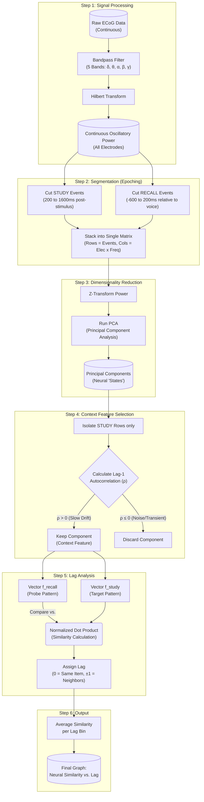

# Neuroinformatics
This is a repository for uploading documents and codes (primarily in MATLAB) for the course contents of Neuroinformatics.

I will be following Mike X Cohen's Analyzing Neural Time Series Data

